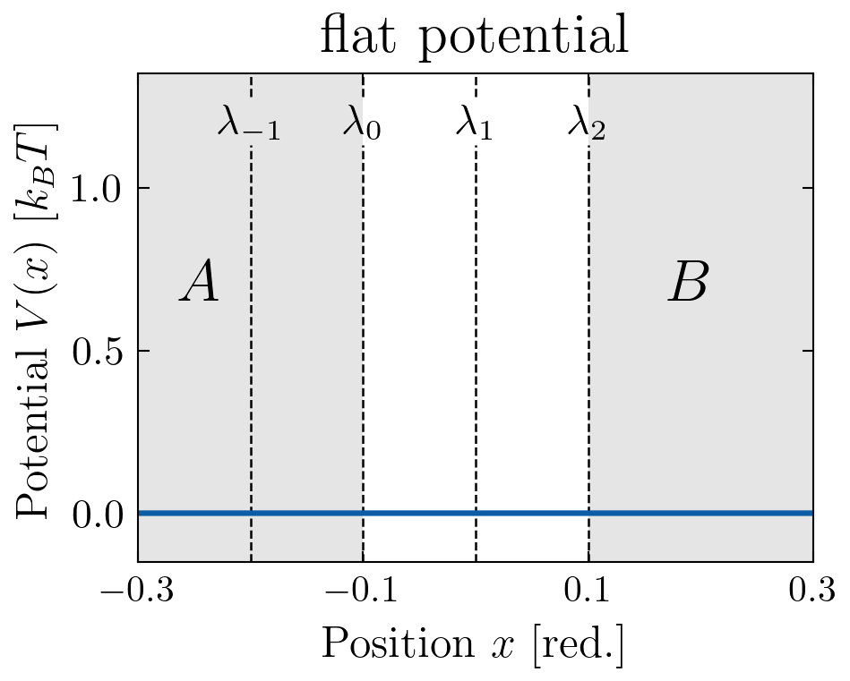
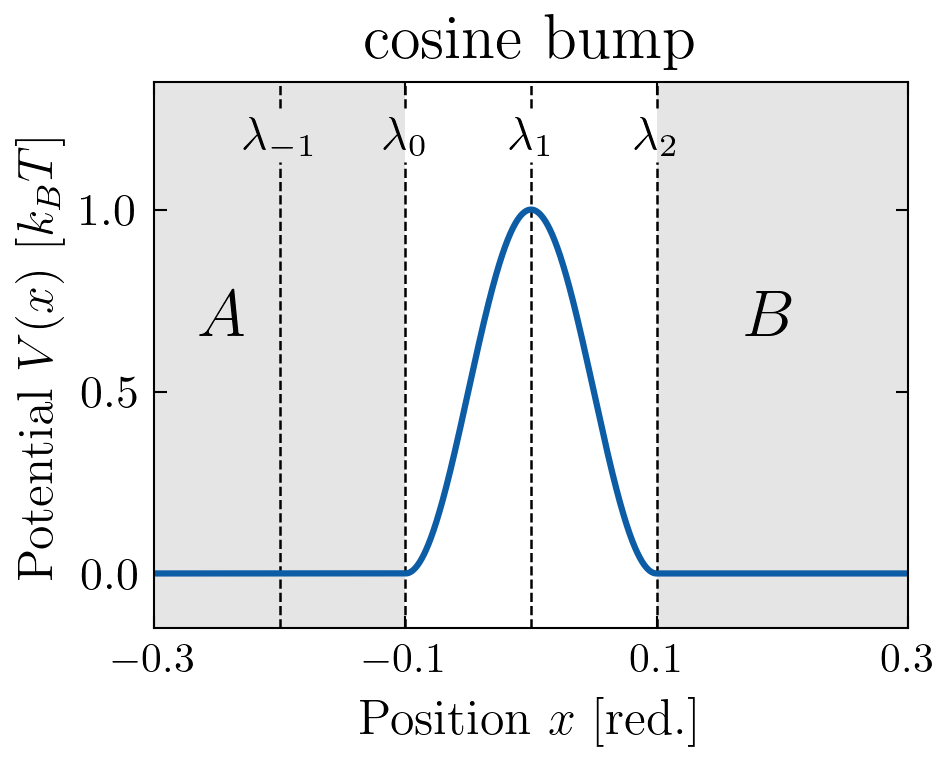

# 1D Single-Particle Systems — ASE engine

> Input files for two 1D single-particle toy systems simulated with
> [**infretis**](https://github.com/infretis/infretis) using the ASE engine.
> Both systems have a potential $V(x)$ symmetric around $x=0$.

---

## Systems

### 1 · Flat potential &nbsp;(`flat/`)

$V(x) = 0$



---

### 2 · Cosine bump &nbsp;(`cos_bump/`)

$V(x) = \frac{\Delta f}{2}\left(1 - \cos\!\left(\frac{2\pi(x - b_L)}{L}\right)\right), \quad x \in [b_L,\, b_R]$

with $\Delta f = 1.0$, $b_L = -0.1$, $b_R = 0.1$.



---

## Simulation details

The order parameter is $\lambda = x$, with interfaces

$\lambda_{-1} = -0.2, \quad \lambda_0 = -0.1, \quad \lambda_1 = 0.0, \quad \lambda_2 = 0.1$

Langevin dynamics parameters (reduced units, [PyRETIS](https://www.pyretis.org/) convention):

| Symbol | Quantity | Value |
| :---: | :--- | :---: |
| $\gamma$ | Friction | 20.0 |
| $m$ | Mass | 1.0 |
| $\Delta t$ | Timestep | 0.002 |
| $T$ | Temperature | 1.0 |

### Unit conversion

Parameters were converted from [PyRETIS](https://www.pyretis.org/) reduced units to ASE internal units with

$\sigma = 1.0~\text{Å}, \qquad \epsilon = 1.0~\text{eV}$

giving a natural time unit $\tau = \sigma\sqrt{m/\epsilon} \approx 10.18~\text{fs}$.

| Parameter | Reduced value | Conversion | ASE value |
| :--- | :---: | :--- | :---: |
| **Friction** $\gamma$ | 20.0 | $\gamma_\text{red}\,\sqrt{\text{eV}/\text{amu}}\,/\,\text{Å}$ | 1.965 fs⁻¹ |
| **Timestep** $\Delta t$ | 0.002 | $\Delta t_\text{red}\cdot\text{Å}\sqrt{\text{amu}/\text{eV}}$ | 0.0203 fs |
| **Temperature** $T$ | 1.0 | $T_\text{red}\cdot\text{eV}/k_B$ | 11604.5 K |

---

## Directory structure

```text
.
├── flat/
│   ├── load_copy/          # initial paths
│   └── wham_example/       # inft wham output (100 000 MC moves)
├── cos_bump/
│   ├── load_copy/
│   └── wham_example/
└── results_plot/           # analysis plots (varying γ and m)
```

Each system folder contains an `infretis.toml` configuration file and a `runner.sh` launch script.

---

## Usage

```bash
chmod +x runner.sh
./runner.sh
```

After the run, compute kinetic properties and the conditional free energy with:

```bash
inft wham -lamres 0.005 -fener
```
