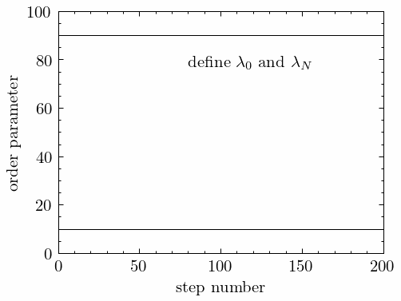

  <h1 align="center">
The Ring Flip Enigma:

Unveiling Molecular Secrets with Path Sampling
</h1>

# Motivation
Through this exercise, we aim to demonstrate the capabilities of path sampling. Path sampling allows us to study rare events that can be hard or impossible to investigate using conventional molecular dynamics methods. The algorithms and software utilized in this assignment are the result of very recent active developments within the research group of Theoretical Chemistry.

If path sampling and software development sound interesting to you, to the extent that you would like to study them in more detail, please don't hesitate to get in touch with Titus and Anders to explore potential master projects. You can contact them at titus.van.erp@ntnu.no and anders.lervik@ntnu.no.

# Goals
In this exercise, you'll journey into the heart of molecular mysteries. Your primary goal is to study the conformational transition of the oxane [ring flip](https://en.wikipedia.org/wiki/Ring_flip), an intriguing phenomenon often referred to as puckering. This transition, a rare occurrence at the molecular timescale, has puzzled scientists for ages. With your newfound knowledge in path sampling, you now hold the key to understanding its mechanisms. Your quest? To reveal the secrets hidden within the molecular world.

# The system
<p align="center">

</p>

This oxane puckering transition rarely occurs at the molecular time scale, making it challenging to study with standard molecular dynamics simulations. On the macroscale, these systems are awfully small and the transition happens exceedingly fast, making it almost impossible to study experimentally. Truly, this process remains hidden within the world of molecules! However, <ins>we would like to know exactly how often this transition occurs and the mechanism behind it </ins>. We can obtain this information by performing a path-sampling simulation.

<details>
<summary> ... for the interested reader 🤓 </summary>

## Even more about the system

6-rings play a vital role in the world of chemistry and biology, impacting systems as diverse as carbohydrates being broken down by enzymes within your very body. The physical and chemical properties of 6-rings are intimately linked to their conformations, and their conformational landscape is a puzzle to be unraveled, with **C**hair, **H**alf-chair, **B**oat, **S**kew-boat, and **E**nvelope conformations. The conformations of 6-rings can be projected onto the surface of a sphere, where each conformer is uniquely specified by the angles $\theta$ and $\phi$.


These angles should not be viewed as regular angles between atoms, but rather as a coordinate transformation of the atoms that can be mapped onto the surface of a sphere [[1](https://doi.org/10.1021/ja00839a011)]. But the "hows" aren't important right now. The essential thing you need to know for now is that there is a high energy barrier between the north pole and the equator, and again between the equator and the south pole. We will study the transition over the first barrier; _starting at the north pole and ending at any of the structures on the equator_. By the end of this exercise, you will be able to say exactly how often this transition happens and elucidate the mechanism behind it.

### Can you answer these?
* Given that the 6-ring in the animation above starts as $^4\text{C}_1$, can you see that the ending structure is $^{3,O}B$? Hint: The super- and subscripts refer to which atoms are above and below the mean plane of the ring, respectively.

* What is the initial value of the angle $\theta$, and what are the final values of the angles $\phi$ and $\theta$?

* Can you suggest an order parameter for this transition?

</details>


# Step 0: Installing the required packages
If you don't already have a Python package manager running, download and install mamba with the following commands

Life hack: Pressing down the middle mouse button (wheel) works better for pasting than ctrl+V 😎 

```bash
curl -L -O "https://github.com/conda-forge/miniforge/releases/latest/download/Miniforge3-$(uname)-$(uname -m).sh"
bash Miniforge3-$(uname)-$(uname -m).sh
```
Now close the terminal.

If everything went successfully, you should see `(base)` in the left of your terminal.

```bash
mamba create --name molmod python==3.11
```
```bash
mamba activate molmod
mkdir software
cd software
git clone https://github.com/infretis/infretis.git
cd infretis
python -m pip install -e .
cd -
git clone https://github.com/infretis/inftools.git
cd inftools
git checkout molmod24
python -m pip install -e .
cd ~
git clone https://github.com/infretis/infentory.git
cd infentory/puckering
git checkout molmod24
echo "All done! We will perform the exercise from this folder."
```

You should now see `(molmod)` in the left of your terminal. Whenever you open a new terminal, write `mamba activate molmod`.

# Step 1: Equilibration
As you know, path sampling is a hybrid of molecular dynamics (MD) and Monte Carlo simulations (MC). Therefore, before we can start the path sampling simulation, we need to set up our system just like we would for a regular MD run. That includes setting up the force field and equilibrating the system. 

The force field has already been set up for you. We will be using the [OpenFF 2.1](https://openforcefield.org/force-fields/force-fields/) force field for oxane (the puckering molecule) and the TIP3P model for water.

Run the following command:
```bash
cd gromacs_input
gmx solvate -cs spc216.gro -cp mol.gro -p topol.top -o conf.g96
```

🏁 This exercise contains a couple of questions. Write down your answers and show/discuss them with the teaching assistants to pass this exercise.

#### 🤔 Question 1:
* What does the above command do?

Navigate to the `step1_equilibration` folder and get an overview of the directory structure. Perform an energy minimization (EM) and an NVT and NPT equilibration in the provided directories. Here are some commands to speed up the process.

```bash
gmx grompp -f em.mdp -p ../../gromacs_input/topol.top -c ../../gromacs_input/conf.g96 -o em.tpr
gmx mdrun -deffnm em -ntomp 2 -ntmpi 1 -pin on -v

```
```bash
gmx grompp -f nvt.mdp -p ../../gromacs_input/topol.top -c ../em/em.gro -o nvt.tpr
gmx mdrun -deffnm nvt -ntomp 2 -ntmpi 1 -pin on -v

```
```bash
gmx grompp -f npt.mdp -p ../../gromacs_input/topol.top -c ../nvt/nvt.gro -t ../nvt/nvt.cpt -o npt.tpr
gmx mdrun -deffnm npt -ntomp 2 -ntmpi 1 -pin on -v

```
#### 🤔 Question 2:
* Has the temperature and density reached the expected values during the NPT equilibration? The properties are accessible using `gmx energy -f npt.edr`. (Hint: retaw yltsom si metsys ruoY. Hint2: The previous sentence is reversed to avoid spoilers.)

# Step 2: MD run
We are now going to perform a slightly longer MD run with the equilibrated system. Navigate to the `step2_md_run` folder and run

```bash
gmx grompp -f md.mdp -p ../gromacs_input/topol.top -c ../step1_equilibration/npt/npt.gro -t ../step1_equilibration/npt/npt.cpt -o md_run.tpr
gmx mdrun -deffnm md_run -ntomp 2 -ntmpi 1 -pin on -v -c confout.g96
```

This run should take a couple of minutes. You can use the time to answer the following question.

#### 🤔 Question 3:
* What is an order parameter in path sampling, and why do we need it?

After the run completes, calculate the order parameter for each frame in the trajectory:
```bash
inft recalculate_order -traj md_run.trr -toml infretis.toml -out md-order.txt

```
Plot the order parameter values (column 1) vs time (column 0) from the MD run using e.g. gnuplot.

#### 🤔 Question 4:
* Given that the product state of your molecule is defined by $\lambda=90$, are you optimistic that you could observe a spontaneous transition during a plain MD simulation? How can path sampling help with this this?

It is always a good idea to visualize trajectories to ensure everything is running as expected, and that our molecules haven't blown up 💥 We will use the popular visual molecular dynamics ([VMD](https://www.ks.uiuc.edu/Research/vmd/)):

```bash
# fix molecule if broken by periodic bodunaries
printf 'Other\nSystem' | gmx trjconv -f md_run.trr -pbc mol -center -s md_run.tpr -o trajout.xtc
printf 'Other\nSystem\n' | gmx trjconv -f trajout.xtc -fit rot+trans -s md_run.tpr
rm \#trajout.xtc.1\#
# then visualize
vmd trajout.xtc ../step1_equilibration/npt/npt.gro -e ../graphics/vmd-script.tcl
```

To animate the trajectory, press the tiny ▶️ button on the far right in the VMD Player:


# Step 3: ∞RETIS
We will now perform the actually path sampling simulation.

The process of going from an equilibrated MD system to a path sampling simulation can be a bit tedious. But for that, we can use the initial path generator `infinit`, which performs the whole path-sampling simulation workflow using  ∞RETIS under the hood. The way it works is illustrated below.



Navigate to the `step3_infretis` directory.

Open `infretis0.toml`, which defines all the path sampling setup. 

In the [simulation] section, define the initial state and final state by specifying two interfaces at $\lambda=10$ and $\lambda=90$ in `infretis0.toml`.

In the [infinit] section, specify  `initial_conf = "../step2_md_run/confout.g96"`, which starts the path-sampling simulation from that configuration. 

Start the path sampling simulation with

```bash
inft infinit -toml infretis0.toml
```
As we wait for it to finish, answer the following question:

#### 🤔 Question 5:
* How does path sampling combine molecular dynamics and Monte Carlo?

Then, open a new terminal and move to the next step.

# Step 4: Analysis
The following analysis is performed within the `step3_infretis` folder.

## The transition mechanism
While infretis is running, we can visualize some of the reactive trajectories it has produced to gain some mechanistic insight of the puckering transition 🤓

Identify the folder names of some reactive trajectories by running the below command ⌛ If you don't get any message from the below command, wait for infretis to produce some reactive trajectories ⏳

```bash
inft plot_order -traj load/ -toml infretis.toml
```

Once you have a reactive trajectory, create a .xyz file to visualize the transition:

```bash
reactive_path=load/123
inft trjcat -traj ${reactive_path}/traj.txt -out vis.xyz -centersel "index 0 to 15 and element C O" -selection "index 0 to 15" -topology ../gromacs_input/topol.tpr
```

Then visualize the trajectory with:

```bash
vmd vis.xyz -e ../graphics/vmd-script.tcl
```
#### 🤔 Question 6:
* Can you explain how oxane changes conformations from state A to state B?

## The transition rate

📈 When you approach a reasonable number of paths in your simulation you can start analyzing the output, such as the transition rate. We use the weighted histogram analysis method (WHAM) for this.


The following script calculates the rate, along with some other properties such as the crossing probability and some error estimates.

```bash
inft wham -data infretis_data_4.txt -toml $(if [ -e infretis_4.toml ]; then echo infretis_4.toml ; else echo infretis.toml; fi) -lamres 0.005 -nskip 40
```
The running average of the rate is written to the `runav_rate.txt` file, with the value in the fourth column giving the best estimate for the rate.

You can plot it in `gnuplot`

```bash
# in gnuplot
set logscale y
set ylabel "transition rate estimate"
set xlabel "number of accepted paths"
plot 'wham/runav_rate.txt' using 1:4 with linespoints
```

The last line/point in this file is the estimated transition rate using all paths. To get this into units of $\text{ns}^{-1}$, divide the rate by $c$ where

$$c=\frac{\text{subcycles}\cdot \text{timestep}}{1000} $$

`timestep` and `subcycles` are specified in `infretis0.toml`.


#### 🤔 Question 7 - 9:
* What is the rate in units of $\text{ns}^{-1}$?
* What is the interpretation of the inverse of the rate (1/rate)? (Hint: noitisnart rep emit ni era stinu ehT).
* Inspect the last part of the `md_run.log` file from `step2_md_run` and write down the Performance in ns/day. This number says how many nanoseconds of simulation you generate in one day on your machine. From the value of the inverse rate, how many days would you have to wait to observe a single puckering event in a standard MD simulation?
